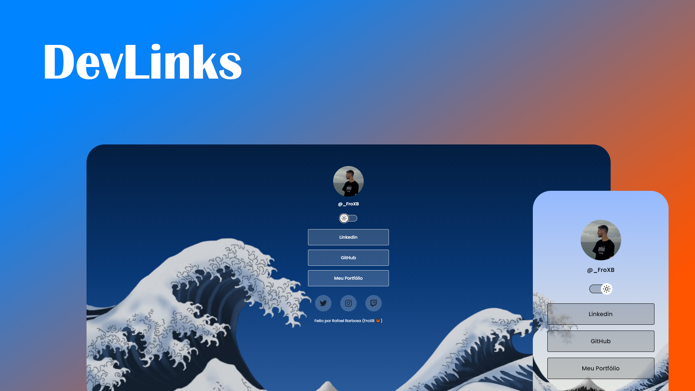

<h1 align="center"> DevLinks </h1>

<h3 align="center">
Feito durante a realização do curso "discover", da RocketSeat.  

  

 

  

## 🚀 Tecnologias

Esse projeto foi desenvolvido com as seguintes tecnologias:

- HTML e CSS
- JavaScript
- Git e Github
- Figma

## 💻 Projeto

O DevLinks é um agregador de links para usar como cartão de visitas online.

## :memo: Licença

Esse projeto está sob a licença MIT.

---

